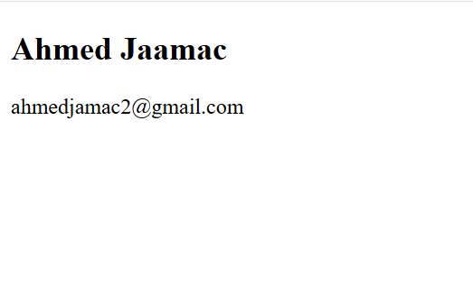

# UserCard

This exercise displays a simple user card component.

It shows the following information:

- **User Name**
- **Email**

Example structure used in the component:

<h2>User Name</h2>

Email

## Result

