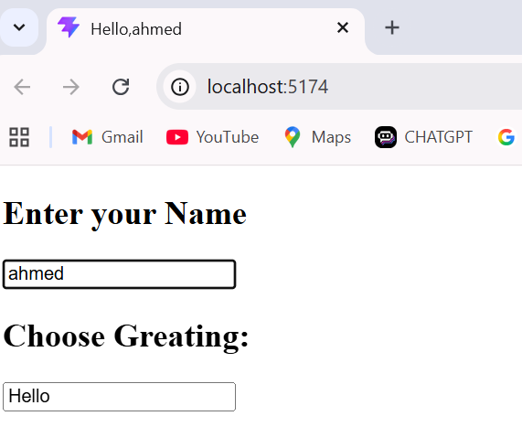

# useEffect 

This project practices the React **useEffect** hook by updating the browser's document title based on the username input.

## Features

- Shows **"Welcome"** in the document title when the username input is empty.
- Shows **"Greeting, username"** when a user types their name in the input field.

## Result

