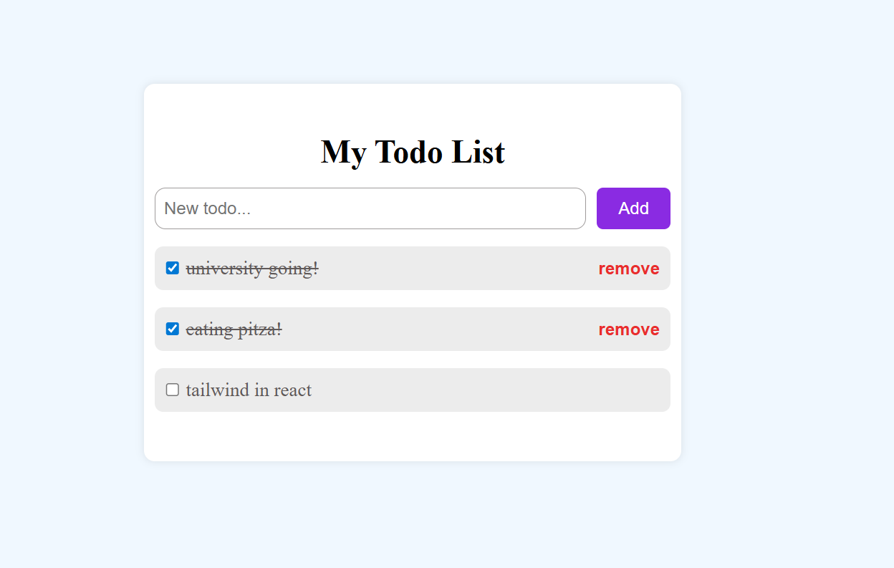

# Todo List UI Css In React

This exercise displays TodoList with Fuctionality Using useContext and UseReducer 

It has these fuctionalities:

- **adding new task**
- **complte task**
- **delete if completed**

## Result

